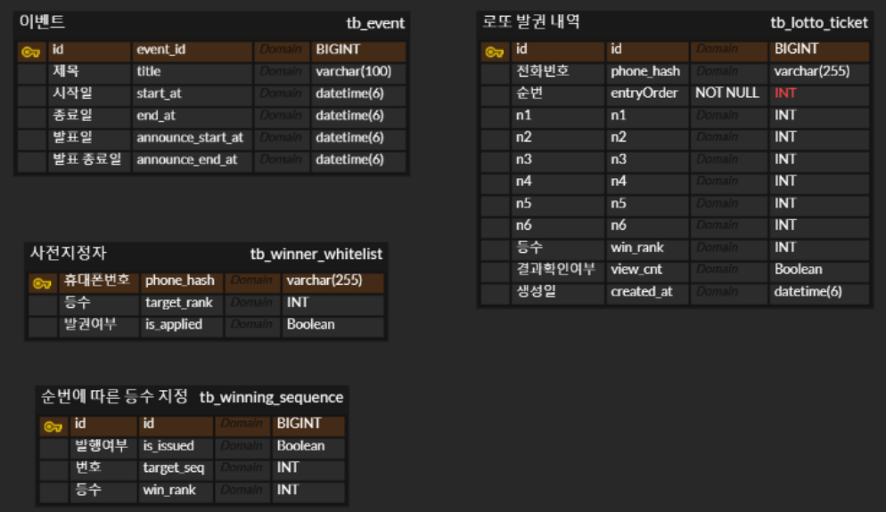
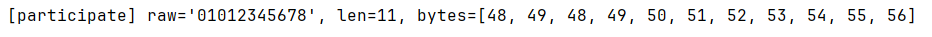
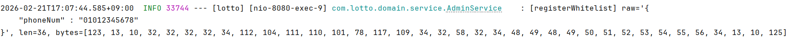

# 로또 이벤트 시스템 (Lotto Event System)

## 핵심 기능

1.  **이벤트 참여 및 발권**: 정해진 기간 내에 휴대폰 번호를 기반으로 로또 티켓을 발권합니다.
2.  **당첨 결과 조회**: 발권된 티켓의 당첨 여부를 확인하며, 첫 조회 시에만 당첨 등수를 노출하고 이후로는 당첨/미당첨 여부만 확인 가능하도록 했습니다.
3.  **참여 제한 및 제어**: 하루에 한 번만 이벤트 페이지로 자동 유도하며, 총 선착순 10,000건의 참여 제한을 둡니다.
4.  **당첨 시스템**: 사전에 특정 전화번호를 기준으로 정의된 화이트리스트(1등 당첨자) 및 특정 순번 기반의 당첨 로직을 구현했습니다.

## Tech Stack

-   **Language**: Java 17
-   **Framework**: Spring Boot 4.0.2
-   **ORM**: Spring Data JPA
-   **Database**: MySQL
-   **View**: JSP (Jakarta), JSTL
-   **Security**: SHA-256 Hashing

## 핵심 설계 및 구현

### 1. 개인정보 보호
-   **휴대폰 번호 해싱**: 개인정보 보호를 위해 실제 휴대폰 번호를 저장하지 않고, `SHA-256` 해시값(`phoneHash`)을 기반으로 사용자를 식별합니다. 이를 통해 DB 유출 시에도 개인정보 피해를 최소화했습니다.

### 2. 성능
-   **인덱스 설계**: 대량의 조회 성능을 보장하기 위해 `phoneHash`와 `entryOrder` 컬럼에 인덱스를 부여했습니다.
-   **배치 인서트(Batch Insert)**: 사전에 1~10000명의 지정 등수를 insert할 때, 다량의 데이터 동시 처리를 위해 배치 설정을 적용했습니다. 
- 1. application.yaml에서 `hibernate.jdbc.batch_size`를 설정하여 메모리에서 묶을 단위를 지정. 
- 2. JDBC URL에 `rewriteBatchedStatements=true` 옵션을 추가하여, 실제 DB에 날릴 때 쿼리를 하나로 합치도록 설정.

### 3. 당첨 및 번호 생성 로직
-   **당첨 검증 시스템**:
    1.  **사전 지정 1등 당첨자 확인**: 특정 사용자에게 당첨을 우선 배정하기 위해 해싱된 전화번호 기반의 `WinnerWhiteList`를 먼저 확인합니다.
    `WinnerWhiteList`는 관리자가 사전에 1~10000까지 미리 생성합니다.
    2.  **선착순 순번 방식**: 특정 순서(예: 777번째)에 참여한 사용자에게 지정된 등수를 부여하는 `WinningSequence` 방식을 적용했습니다.
    `WinningSequence`는 관리자가 사전에 1~10000까지 미리 생성합니다.
-   **로또 번호 생성 알고리즘 (`LottoGenerator`)**:
    -   미리 정의된 **당첨 번호 (`7, 14, 21, 28, 35, 42`)**를 기준으로 등수에 따라 매칭 개수를 조절하여 동적으로 생성합니다.
    -   **1등**: 6개 번호 일치
    -   **2~4등**: `7 - 등수`만큼의 번호가 일치하도록 조합 (예: 2등은 5개 일치)
    -   **미당첨**: 0~2개만 무작위로 매칭되도록 설계했습니다.

### 4. 상태 관리
-   **쿠키 기반 접속 관리**: `index.jsp`에서 클라이언트 사이드 쿠키(`lotto_event_seen`)를 사용하여, 참여 완료 후에는 해당 페이지가 뜨지 않도록 설계했습니다.
-   **조건부 결과 노출**: `viewCnt` 기반의 분기 처리를 통해 첫 조회 시에만 상세 등수를 출력하도록 구현했습니다.

### 5. Error 관리 일원화
-   **ErrorCode, CustomException**: Enum과 CustomException을 사용하여 하드코딩 대신 통일된 에러 응답값을 반환했습니다.

## 프로젝트 구조

-   `EventController`: 참여/결과 조회 흐름 제어
-   `EventService`: 로또 이벤트 핵심 비즈니스 로직
-   `WinningSequence`: 특정 순번 기반의 당첨자 설정 관리
-   `WinnerWhiteList`: 특정 대상자(전화번호 기반) 기반의 당첨 관리
-   `LottoGenerator`: 로또 번호 생성기

### ERD

### 트러블 슈팅 (JSP로 변경하기 전 REST API 방식으로 했었을 때 문제상황)

1. **문제 상황**: 
   동일한 전화번호(01012345678)를 입력했음에도 불구하고, 사전 당첨자 번호 등록(registerWhitelist) 시 생성된 해시값과 로또 발권(issue) 시 생성된 해시값이 일치하지 않아 당첨 로직이 정상적으로 작동하지 않는 현상 발생. 
2. **원인**: `@RequestBody String`은 JSON의 기호(따옴표)나 클라이언트가 보낸 공백/개행을 가공 없이 그대로 변수에 담기 때문에, 육안으로는 같아 보여도 실제값이 달라져 해시 결과가 다르게 생성.
   
   
3. 해결
   **DTO사용**
   @RequestBody 사용 시 문자열을 직접 받지 않고 DTO로 받아 동일한 값을 보장할 수 있었습니다.
